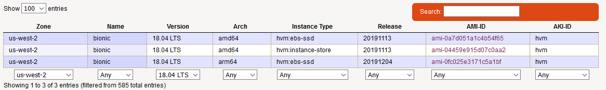

# Project Analysis
**Author:** Devin Yang

---
## First Problem Report
In course the tutor told us to set availability zone to **us-west-2**, i tried many times, it always showed the error **Acess Denied**, then i refer to the vocareum website, there is a Q&A: 

> **I can't start any resources. What happened?**
Please check in top right of you AWS Console view to confirm the region is N. Virginia. Only us-east-1 (Northern Virginia) is supported by AWS Educate Accounts Change your region to us-east-1 to start your resources. Alternatively please check allowed services above. Only services listed above can be used in AWS Educate Accounts.

so i changed the AZ from **us-west-2** to **us-east-1**, worked!

With AWS Educate Account i can not create a IAM role, i can only use **us-east-1** AZ, i am not authorized to create a NAT and so on, this generated many problems and made me crazy. So finally i used my own account, got issues solved.

**Question:** Am i wrong to use AWS Educate Account?

## Server Spec:
1. 4 servers
    + 2 EC2 Instances
    + Load balancer server
    + S3 bucket
2. 4 subnets, 2 private and 2 public servers
3. 2 vCPU & at least 4GB RAM
    Refer to [EC2 Instance Type](https://amazonaws-china.com/ec2/instance-types/?nc1=h_ls), all the up-to-date aws ec2 instance types are listed. Look through the use case of each instance type, For Udagramm project, **General purpose** instance best suites our requirment here. And for **2 vCPU and at least 4GB RA** usage, **t3.medium** can meet this requirment.
4. At least 10GB of disk space
5. Ubuntu 18 operating system
    + Refer to [AMIs](https://cloud-images.ubuntu.com/locator/), locate to AZ **us-west-2**, and version **18.04 LTS**, then 3 available AMIs left, 
    
    because of the storage of EC2 Instance **t3.medium** we just chosen is **EBS only**, so the newest uploaded AMI **ami-0fc025e3171c5a1bf** was chosen, but it is weird, an error occured, said this AMI not suits the architecture or something, i go found anouther soluthion, **ami-0b37e9efc396e4c38** worked, but can not find the official origin of this AMI.  
    + By running the launch config, it is better if we could install some default tools for some dedicated work, for **Udagramm** project, we need **awscli** and **zip** tool

```yaml
UdagrammLaunchConfig:
    Type: AWS::AutoScaling::LaunchConfiguration
    Properties:
      UserData:
        Fn::Base64: !Sub |
          #!/bin/bash
          apt-get update -y
          apt-get install unzip awscli -y
          apt-get install apache2 -y
          systemctl start apache2.service
          cd /var/www/html
          aws s3 cp s3://udacity-Udagramm/udacity.zip .
          unzip -o udacity.zip
      ImageId: ami-0b37e9efc396e4c38
      IamInstanceProfile: !Ref ProfileWithRolesForOurApp
      SecurityGroups:
      - Ref: WebServerSecGroup
      InstanceType: t3.medium
      BlockDeviceMappings:
      - DeviceName: "/dev/sdk"
        Ebs:
          VolumeSize: '10'
```

## Security Groups and Roles
1. IAM role for S3 bucket access, In this project i created manually, not by deploying code
```yaml
IAM Role
    S3AccessIAMRole:
        Type: AWS::IAM::Role
        Properties: 
            AssumeRolePolicyDocument: Json
            Path: String # Default value is "/" and though not required this property might be important
            Policies: 
            - Policy
            RoleName: String

    # IAM Policy
    S3AccessIAMPolicy:
        Type: AWS::IAM::Policy
        Properties:
            PolicyDocument: Json
            PolicyName: String
            Roles: 
                - S3AccessIAMRole

    # S3 Bucket Policy
    S3AccessBucketPolicy:
        Type: AWS::S3::BucketPolicy
        Properties:
            PolicyDocument:
                Id: MyPolicy
                Version: '2012-10-17'
                Statement:
                - Sid: ReadAccess
                    Action:
                    - s3:GetObject
                    Effect: Allow
                    Resource: !Sub "arn:aws:s3:::${AccessLogsS3Bucket}/*"
                    Principal:
                        AWS: !GetAtt user1.Arn
            Bucket: !Ref mybucket
```